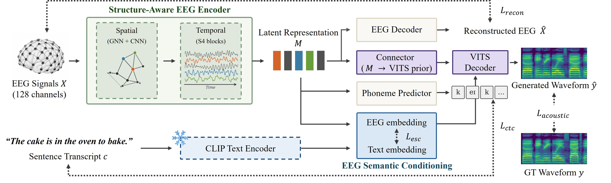

# SENSE

Official implementation of **SENSE: Semantic Neural Speech Synthesis from Brain Dynamics via Spatial Graph Encoding** (NeurIPS 2026).

SENSE reconstructs speech waveforms directly from non-invasive EEG. It combines a graph-based EEG encoder defined over electrode geometry with **EEG Semantic Conditioning (ESC)**, which aligns the EEG latent to a frozen CLIP text embedding using congruent trials only. At inference only EEG is required.

[Project page](https://jisoo-o.github.io/website/projects/SENSE/)

<p align="center">
  
</p>

EEG is encoded into a latent representation and mapped to the prior of a VITS speech decoder. Solid arrows are the forward data flow, dashed arrows are loss supervision. The EEG decoder, phoneme predictor, and CLIP encoder are used during training only and discarded at inference.

## Installation

```sh
conda create -n sense python=3.8
conda activate sense
pip install -r requirements.txt
```

Tested with PyTorch 2.4.1 and CUDA 12.1 on a single RTX 3090.

## Data

Experiments use the [N400 EEG corpus](https://doi.org/10.5061/dryad.6wwpzgmx4) of Toffolo et al. (2022) (24 subjects, 440 sentences each, 128-channel EEG at 512 Hz). Following prior work we exclude four unreliable subjects, leaving 20.

Preprocess the corpus into the following layout:

```
<data_root_dir>/
├── processed/
│   └── sub-01/sub-01-_-<stimulus_id>.npy      # (128, T) float32, 512 Hz
└── stimuli_22k/
    └── <stimulus_id>_22k.wav                  # 22,050 Hz mono
```

Then point `data.data_root_dir` in `configs/sense.json` at that directory.

The file lists in `filelists/n400/` define the three evaluation splits used in the paper:

| File list | Split | Held out |
|---|---|---|
| `filelist_train_text_ipa.txt` | train | 18 subjects x 400 sentences |
| `filelist_test_unseen_audio_text_ipa.txt` | Unseen audio | sentences |
| `filelist_test_unseen_subject_text_ipa.txt` | Unseen subject | sub-23, sub-24 |
| `filelist_test_unseen_both_text_ipa.txt` | Unseen both | sentences and subjects |

Each line is `<eeg/stimulus path>||<transcript>||<IPA phonemes>`.

CLIP text embeddings for all 440 sentences are precomputed in `clip_cache/n400_clip_embeddings.pt` (CLIP ViT-B/32 text encoder), so no extra step is needed to train. Rerun this only for a different sentence set:

```sh
python preprocess/precompute_clip_embeddings.py -c configs/sense.json
```

## Training

```sh
python train.py -c configs/sense.json -m sense
```

Checkpoints and logs are written to `logs/<run_name>/`. Add `-w y` to log to Weights & Biases. The model in the paper was trained for 200k iterations on a single GPU.

## Inference

```sh
python inference.py --run_name sense --checkpoint_idx best
```

This synthesizes all three evaluation splits and writes them to `logs/<run_name>/synthesized/<checkpoint_idx>/<split>/`, as `{i}_gt.wav` (stimulus) and `{i}_syn.wav` (generated), together with a `texts.json` mapping each index to its transcript. Generation is conditioned on EEG only.

## Pretrained checkpoints

Download: *(link to be added)*

Place the files under `logs/sense/` and run inference with `--checkpoint_idx best`.

## Repository layout

```
train.py              # training
inference.py          # waveform synthesis from EEG
EEGModule.py          # structure-aware EEG encoder (channel gate, GNN, CNN skip, S4)
models.py             # VITS-based speech decoder, connector, ESC projection
modules.py            # network building blocks
attentions.py         # attention layers
losses.py             # training objectives
data_utils.py         # dataset and collation
mel_processing.py     # mel-spectrogram front end
transforms.py         # signal transforms
commons.py, utils.py  # shared helpers
configs/sense.json    # configuration for the model in the paper
s4_block/             # S4 temporal encoder
conformer/            # Conformer block used by the phoneme predictor
text/                 # IPA symbol set and tokenization
preprocess/           # CLIP text embedding cache generation
```

## Acknowledgements

Built on [VITS](https://github.com/jaywalnut310/vits), [S4](https://github.com/state-spaces/s4), and [FESDE](https://github.com/lee-jhwn/fesde).

## License

Released under the [MIT License](LICENSE). Code derived from VITS (MIT) and S4 (Apache-2.0) remains under its original terms.
